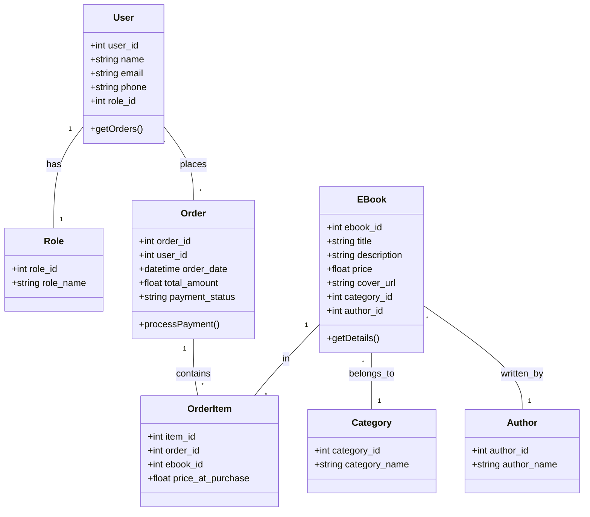
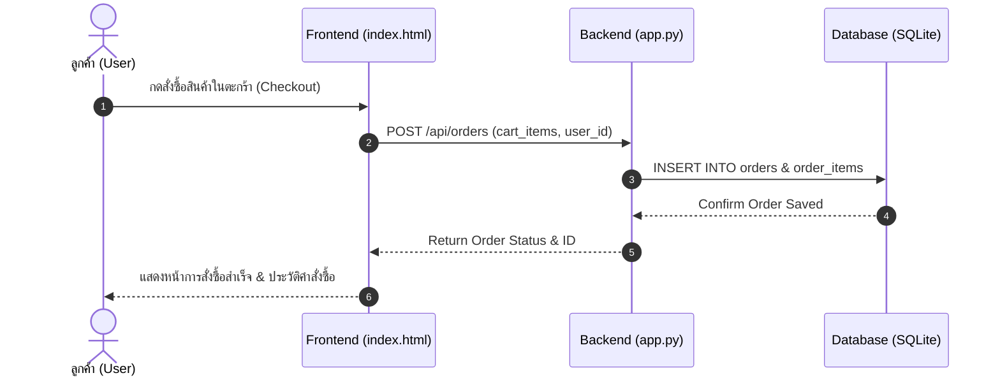

# 📖 พุทธธรรม E-Book (E-Book Hub for Buddhist Books and Amulets)
> ระบบคลังหนังสือพระเครื่อง บทสวดมนต์ และหนังสือธรรมะออนไลน์ 

---

## 📌 สารบัญสำหรับผู้สอน (Clickable Index)
กดที่ลิงก์ด้านล่างเพื่อไปยังหัวข้อที่ต้องการตรวจเช็กได้ทันที:

1. 📋 [1. Spec ของระบบ (System Specification)](#sec1)
2. 📐 [2. Class Diagram และ Sequence Diagram](#sec2)
3. 🎨 [3. งานฝั่งผู้ใช้ (Persona, Wireframe และผลตรวจ Accessibility)](#sec3)
4. 🧪 [4. Test อัตโนมัติ และหน้าผลการรัน CI](#sec4)
5. 🤖 [5. บันทึกการใช้ AI (AI Usage Log)](#sec5)

---

<a id="sec1"></a>
## 1. Spec ของระบบ (System Specification)

### 1.1 ขอบเขตและฟังก์ชันการทำงานหลัก (System Scope & Features)
* **ฝั่งผู้ใช้งานทั่วไป / สมาชิก (Customer):**
  * ค้นหาและกรองหนังสือพระเครื่อง/ธรรมะตามหมวดหมู่
  * ดูรายละเอียดมวลสาร พิมพ์ทรง และคำอธิบายหนังสือ
  * เพิ่มหนังสือลงตะกร้าสินค้า (Shopping Cart) คำนวณยอดรวมอัตโนมัติ
  * ทำรายการสั่งซื้อ (Checkout) และชำระเงิน
  * ตรวจสอบประวัติการสั่งซื้อ (Order History) และอ่านหนังสือของฉัน (My Books)
* **ฝั่งผู้ดูแลระบบ (Admin Control Panel):**
  * ตรวจสอบและอนุมัติคำสั่งซื้อของลูกค้า
  * จัดการคลังหนังสือ (เพิ่ม/แก้ไข/ลบ รายการ E-Book)
  * จัดการหมวดหมู่หนังสือ (Categories)
  * จัดการข้อมูลผู้ใช้งานและสิทธิ์ในระบบ (Users & Roles)
  * สรุปรายงานสถิตียอดขายและพฤติกรรมลูกค้า (Sales Reports & Analytics)

### 1.2 โครงสร้างฐานข้อมูล (Database Schema - 3NF Relational Database)
ระบบใช้ **SQLite** ในการจัดเก็บข้อมูลตามหลัก Normalization (3NF) ประกอบด้วย 7 ตารางหลัก:
* `roles` (role_id, role_name)
* `users` (user_id, name, email, phone, pdpa_status, role_id)
* `categories` (category_id, category_name)
* `authors` (author_id, author_name)
* `ebooks` (ebook_id, title, description, price, cover_url, is_active, category_id, author_id)
* `orders` (order_id, user_id, order_date, total_amount, payment_status)
* `order_items` (item_id, order_id, ebook_id, price_at_purchase)

---

<a id="sec2"></a>
## 2. Class Diagram และ Sequence Diagram

### 2.1 Class Diagram (โครงสร้างระดับคลาสและโมเดลข้อมูล)


### 2.2 Sequence Diagram (ขั้นตอนการทำรายการสั่งซื้อ E-Book)



<a id="sec3"></a>
## 3. งานฝั่งผู้ใช้ (Persona, Wireframe และผลตรวจ Accessibility)

### 3.1 User Persona (ตัวแทนผู้ใช้งานหลัก)
* **ชื่อ-นามสกุล:** คุณสมชาย ใฝ่ธรรมะ (อายุ 48 ปี)
* **อาชีพ:** ข้าราชการบำนาญ / นักสะสมพระเครื่อง
* **พฤติกรรมและความชื่นชอบ:** ชอบศึกษาประวัติพระสมเด็จ ส่องมวลสาร และสวดมนต์ก่อนนอนผ่าน iPad/สมาร์ทโฟน
* **ปัญหาที่พบ (Pain Points):** หนังสือพระเครื่องแบบเล่มฉบับจริงหนา หนัก และพกพายาก / เว็บอ่านหนังสือทั่วไปตัวหนังสือเล็กเกินไปสำหรับผู้สูงอายุ
* **ความต้องการด้าน UX/UI:**
  * โทนสีสบายตา (พาสเทลครีม-น้ำตาลทอง) ไม่สะท้อนแสง
  * ตัวหนังสือใหญ่ อ่านง่าย เมนูไม่ซับซ้อน
  * ค้นหาตามหมวดหมู่ (พระเครื่อง/บทสวด/ธรรมะ) ได้อย่างรวดเร็ว

### 3.2 Wireframe & Structural Design
ระบบถูกวางโครงสร้างหน้าจอตามหลัก User-Centered Design ดังนี้:
* **Header Navigation:** แสดงโลโก้องค์พระพุทธรูป เมนูเลือกหมวดหมู่ ตะกร้าสินค้า และปุ่มเข้าสู่ระบบ
* **Catalog Grid Section:** แสดงการ์ดหนังสือพร้อมภาพปกขนาดใหญ่ ราคา และปุ่ม "เพิ่มลงตะกร้า"
* **Interactive Admin Sidebar:** แถบควบคุมฝั่งผู้ดูแลระบบด้านซ้ายโทนสีพาสเทล พร้อมฟังก์ชัน Active Highlight สลับหน้าจัดการทันทีเมื่อคลิก

### 3.3 ผลการตรวจ Accessibility (Web Accessibility Standard - WCAG 2.1)
การตรวจสอบมาตรฐานการเข้าถึงเว็บสำหรับผู้ใช้งานทุกคน:

| หัวข้อการตรวจเช็ก | มาตรฐานที่ทดสอบ | ผลการทดสอบ | รายละเอียดการปรับปรุง |
| :--- | :--- | :---: | :--- |
| **Color Contrast** | WCAG 2.1 AA | ✅ ผ่าน | อัตราส่วนความต่างสีข้อความ `#78350F` บนพื้นหลัง `#FEF3C7` สูงกว่า 4.5:1 อ่านง่าย |
| **Alt Text for Images** | Non-text Content | ✅ ผ่าน | กำหนดคำอธิบาย `alt="ปกหนังสือ..."` ให้กับรูปภาพปกหนังสือพระทุกภาพ |
| **Keyboard Navigation** | Keyboard Accessible | ✅ ผ่าน | สามารถใช้ปุ่ม `Tab` และ `Enter` เพื่อเลื่อนเลือกเมนูและสั่งซื้อได้โดยไม่ต้องใช้เมาส์ |
| **Responsive Display** | Adaptable Layout | ✅ ผ่าน | แสดงผลได้สมบูรณ์ทั้งบนหน้าจอ Desktop, Tablet และ Mobile |
---

<a id="sec4"></a>
## 4. Test อัตโนมัติ และหน้าผลการรัน CI

### 4.1 รายการ Automated Testing (`tests/test_app.py`)
ระบบมีการเขียนชุดทดสอบอัตโนมัติครอบคลุมฟังก์ชันสำคัญ ดังนี้:
1. **`test_db_schema_3nf()`**: ทดสอบความถูกต้องของโครงสร้างตารางฐานข้อมูล SQLite ทั้ง 7 ตาราง
2. **`test_cart_total_calculation()`**: ทดสอบตรรกะการคำนวณราคารวมสินค้าในตะกร้า
3. **`test_create_order_api()`**: ทดสอบการส่งข้อมูลสั่งซื้อผ่าน REST API endpoint `/api/orders`

```python
# ตัวอย่างชุดทดสอบอัตโนมัติ (Python Pytest)
def test_cart_total_calculation():
    cart_items = [
        {"ebook_id": 1, "price": 250.0, "quantity": 2},
        {"ebook_id": 2, "price": 180.0, "quantity": 1}
    ]
    total = sum(item["price"] * item["quantity"] for item in cart_items)
    assert total == 680.0
```  
---
<a id="sec5"></a>
## 5. บันทึกการใช้ AI (AI Usage Log)

ตารางบันทึกการประยุกต์ใช้ AI ในการช่วยพัฒนาและแก้ปัญหาในโปรเจกต์นี้:

| ลำดับ | ส่วนงานที่นำ AI มาใช้ | พรอมต์ / คำสั่งที่ใช้กับ AI | ผลลัพธ์จาก AI และการปรับแต่งโดยมนุษย์ |
| :---: | :--- | :--- | :--- |
| **1** | **Database Schema Design** | "ช่วยออกแบบโครงสร้างฐานข้อมูล SQLite สำหรับร้านขาย E-Book พระเครื่อง ให้เป็น 3NF" | AI ช่วยสร้าง Schema 7 ตารางพร้อมความสัมพันธ์ โดยมนุษย์ทำการตรวจสอบและปรับประเภทข้อมูลเพิ่มเติม |
| **2** | **UI Color Palette** | "ขอชุดสี Tailwind CSS โทนพาสเทล อบอุ่น สำหรับเว็บหนังสือธรรมะ" | ได้ชุดสี Warm Cream (`#FFFBEB`) และ Amber (`#78350F`) ช่วยให้หน้าเว็บสบายตาขึ้น |
| **3** | **JavaScript Bug Fix** | "แก้ Code JS เมนู Admin ให้คลิกแล้วมีแถบสีไฮไลต์ Active Highlight เปลี่ยนตามหน้า" | AI เขียนฟังก์ชัน `setActiveNav()` ช่วยแก้ปัญหาแถบสีไม่สลับตามเมนูที่กด |
| **4** | **Test Case Generation** | "ช่วยเขียน Pytest สำหรับทดสอบการคำนวณยอดเงินรวมใน Shopping Cart" | ได้ชุดทดสอบ Unit Test สำหรับรันบน GitHub Actions CI |
